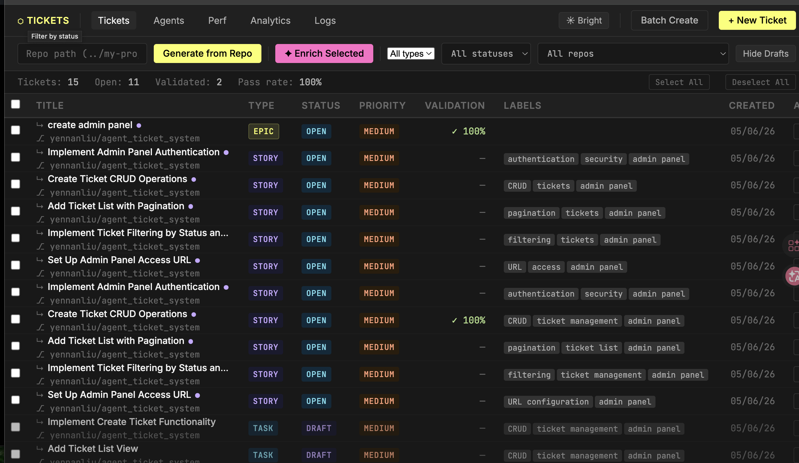
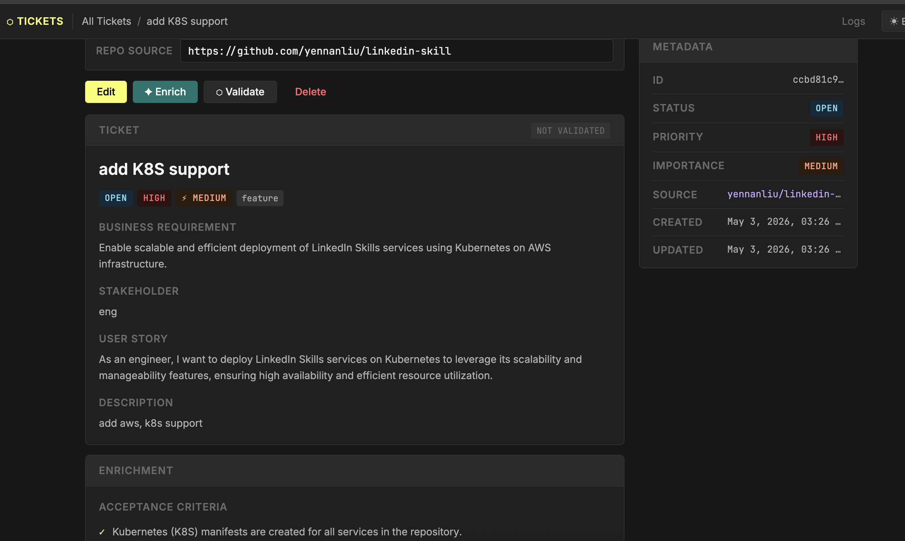
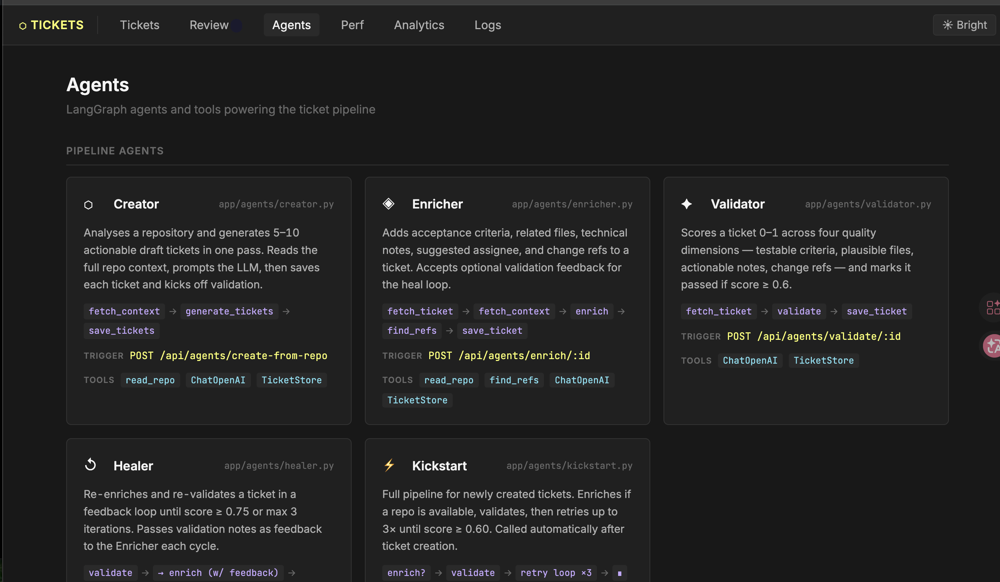
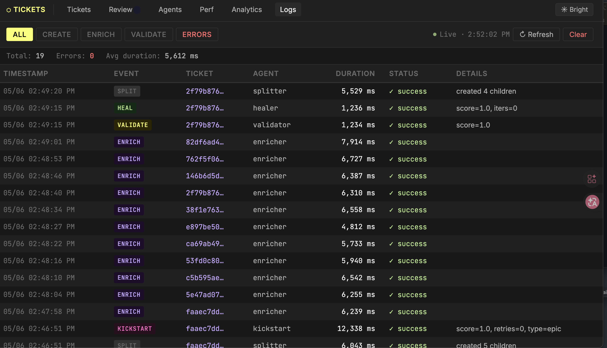

# Agent Ticket System

An AI-powered task ticket manager that analyzes software projects and automatically generates and enriches tickets. Point it at a local repo or a GitHub URL and it produces structured, actionable tickets — no database required.


<p align="center"></p>
<p align="center"></p>
<p align="center"></p>
<p align="center"></p>
<p align="center"></p>

---

## Quick Start

```bash
# 1. Install dependencies
uv sync --extra dev

# 2. Configure environment
cp .env.example .env
# Edit .env and add your OPENAI_API_KEY

# 3. Start the server
uv run uvicorn main:app --reload

# 4. Open the UI
open http://localhost:8000
```

```bash
# 5. kill app using 8000 port

kill -9 $(lsof -ti :8000)
```

## Running Tests

```bash
# Full suite
uv run pytest tests/ -v

# Single file
uv run pytest tests/test_storage.py -v

# Single test
uv run pytest tests/test_api.py::test_create_ticket -v
```

---

## Architecture

```
main.py  (FastAPI, create_app(store))
├── /api/tickets    → app/api/tickets.py   CRUD operations
├── /api/agents     → app/api/agents.py    Agent triggers
│                        ├── app/agents/creator.py   LangGraph (3 nodes)
│                        └── app/agents/enricher.py  LangGraph (4 nodes)
│                              ├── app/indexer.py     RAG indexer (background)
│                              ├── app/repo_tools.py  Repo reader (fallback)
│                              ├── app/search_tools.py Local ref resolver
│                              └── OpenAI (gpt-4o + text-embedding-3-small)
├── /               → static/index.html    Single-file UI
└── storage         → app/storage.py       In-memory + SQLite
```

**Key design decisions:**

- **No ORM.** `TicketStore` keeps an in-memory `dict[str, Ticket]` backed by SQLite. Loaded on startup, written on every mutation.
- **Router factory pattern.** Both routers are created via `make_router(store)`, so tests inject an isolated store without monkeypatching globals.
- **LangGraph graphs are rebuilt per call.** Each `run_creator` / `run_enricher` call compiles a fresh graph. The `TicketStore` is closed over in the save node via a lambda.
- **LLM functions are module-level.** `_llm_generate_tickets` and `_llm_enrich_ticket` are top-level functions so tests can patch them cleanly.
- **RAG is opt-in.** Set `RAG_ENABLED=true` to activate semantic chunk retrieval in the enricher. The indexer runs in a background thread and the enricher falls back to brute-force `read_repo` until the index is warm.

---

## Core Feature: Agent Flow

### Auto-Create (Creator Agent)

Given a repo source, the creator agent runs a 3-node LangGraph:

```
fetch_context → generate_tickets → save_tickets
```

1. **fetch_context** — calls `read_repo(source)` to build a `RepoContext` (file tree, README, file contents, capped at 50 KB)
2. **generate_tickets** — sends repo context to OpenAI and asks for 5–10 structured ticket drafts as JSON
3. **save_tickets** — creates a `Ticket` for each draft and persists to the store

### Auto-Enrich (Enricher Agent)

Given an existing ticket ID and a repo source, the enricher runs a 4-node LangGraph:

```
fetch_ticket → fetch_context → enrich → find_refs → save_ticket
```

1. **fetch_ticket** — loads the existing ticket from the store
2. **fetch_context** — fetches repo context. With `RAG_ENABLED=true` and a local repo, retrieves the top-k semantically relevant code chunks from the background index instead of dumping a fixed 50 KB slice. Falls back to `read_repo` if the index isn't ready yet, and triggers background indexing for next time.
3. **enrich** — sends ticket + repo context to OpenAI; returns acceptance criteria, related files, technical notes, and suggested assignee
4. **find_refs** — resolves `related_files` to actual local file paths (exact match → Jaccard similarity fallback) or GitHub blob URLs, with a content snippet
5. **save_ticket** — merges enriched fields into the existing ticket

### Repo Reader (`app/repo_tools.py`)

`read_repo(source)` auto-detects the source type:

| Input | Behaviour |
|-------|-----------|
| Local path (e.g. `../my-project`) | Walks the filesystem, skips `node_modules`, `.git`, `__pycache__` etc., reads source files (`.py`, `.js`, `.ts`, `.md`, `.json`, …), caps at 50 KB |
| GitHub URL (e.g. `https://github.com/owner/repo`) | Uses PyGithub to fetch README, top-level file listing, and up to 20 open issues. Set `GITHUB_TOKEN` in `.env` for private repos. |

---

## API

| Method | Path | Body | Description |
|--------|------|------|-------------|
| `GET` | `/api/tickets` | — | List all tickets |
| `GET` | `/api/tickets/{id}` | — | Get one ticket |
| `POST` | `/api/tickets` | `CreateTicketRequest` | Create a ticket manually |
| `PUT` | `/api/tickets/{id}` | `UpdateTicketRequest` | Update any ticket fields |
| `DELETE` | `/api/tickets/{id}` | — | Delete a ticket |
| `POST` | `/api/agents/create-from-repo` | `{repo_path?, repo_url?}` | Auto-generate tickets from a repo |
| `POST` | `/api/agents/enrich/{id}` | `{repo_path?, repo_url?}` | Auto-enrich one ticket |

Interactive docs available at `http://localhost:8000/docs`.

---

## Data Model

```python
Ticket
├── id: str                    # UUID4, auto-generated
├── title: str
├── description: str
├── status: str                # "open" | "in_progress" | "done"
├── priority: str              # "low" | "medium" | "high"
├── labels: list[str]
├── source_repo: str           # local path or GitHub URL
├── created_at: datetime
├── updated_at: datetime
│
│   # Populated by the enricher agent
├── acceptance_criteria: list[str]
├── related_files: list[str]
├── technical_notes: str
└── suggested_assignee: str
```

---

## Use Cases

**Generate tickets from a local project**

Paste a local path into the repo panel in the UI (e.g. `../my-service`) and click **Generate from Repo**. The agent reads the codebase and creates 5–10 prioritised tickets covering features, bugs, CI improvements, and docs gaps it identifies.

**Generate tickets from a GitHub repo**

Enter a full GitHub URL (e.g. `https://github.com/owner/repo`). The agent fetches the README, file listing, and open issues to generate tickets. Add `GITHUB_TOKEN` to `.env` for private repos.

**Enrich an existing ticket**

Click **✨ Enrich** on any ticket. The agent re-reads the repo and adds:
- Testable acceptance criteria
- Specific related files from the codebase
- Implementation hints and edge cases
- A suggested role or team for the work

**Manual ticket management**

Create, edit, and delete tickets directly from the UI without involving the AI — useful for capturing tickets from other sources or adjusting AI-generated ones.

---

## Environment Variables

| Variable | Required | Default | Description |
|---|---|---|---|
| `OPENAI_API_KEY` | Yes | — | OpenAI API key |
| `OPENAI_MODEL` | No | `gpt-4o` | Model name passed to `ChatOpenAI` |
| `GITHUB_TOKEN` | No | — | Personal access token for private GitHub repos |
| `RAG_ENABLED` | No | `false` | Enable semantic chunk retrieval in the enricher |
| `RAG_CHUNK_SIZE` | No | `400` | Tokens per chunk when indexing repo files |
| `RAG_TOP_K` | No | `5` | Number of chunks retrieved per enrichment call |
| `EMBEDDING_MODEL` | No | `text-embedding-3-small` | OpenAI embedding model for RAG indexing |
